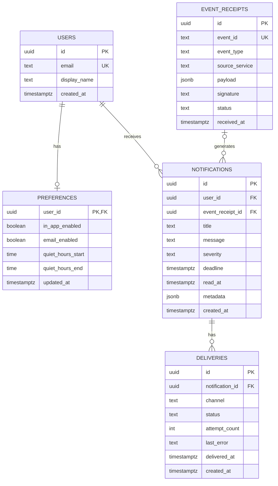

# Notification Hub

A centralized notification service that receives events from external services and delivers notifications to users through multiple channels.

> **Assignment #3 – Database Design** · Team 20
> **Database:** Supabase PostgreSQL · **Backend:** Node.js / Express.js

---

## Table of Contents

- [Features](#features)
- [Tech Stack](#tech-stack)
- [System Architecture](#system-architecture)
- [Database Design](#database-design)
  - [Why Supabase / PostgreSQL](#why-supabase--postgresql)
  - [Tables](#tables)
  - [Relationships](#relationships)
  - [Foreign Key Delete Behavior](#foreign-key-delete-behavior)
  - [ER Diagram](#er-diagram)
- [Database Deployment](#database-deployment)
- [REST API](#rest-api)
- [Security](#security)
- [Getting Started](#getting-started)
- [Automated Testing](#automated-testing)
- [Project Documentation](#project-documentation)

---

## Features

- Receive events from external services
- Prevent duplicate event processing
- Create notifications from events
- Manage user notification preferences
- Support multiple notification channels (in-app, email)
- Track notification delivery status
- Retry failed deliveries
- Mark notifications as read
- Delete notifications
- Backend and database health checks

## Tech Stack

| Layer      | Technology                         |
| ---------- | ---------------------------------- |
| Runtime    | Node.js                            |
| Framework  | Express.js                         |
| Database   | Supabase (PostgreSQL)              |
| DB Client  | Supabase JavaScript client         |
| API Style  | REST                               |
| Testing    | Node.js test runner + Supertest    |

## System Architecture

```
External Service
       |
       |  POST /events
       v
Notification Hub API
       |
       v
  Event Receipt
       |
       v
  Notification
       |
  +----+-----+
  |          |
  v          v
In-App     Email
Delivery   Delivery
  |          |
  +----+-----+
       |
       v
Delivery Status
```

---

## Database Design

### Why Supabase / PostgreSQL

1. **Relational data model** – Users, preferences, event receipts, notifications, and deliveries are clearly related through primary and foreign keys.
2. **Data integrity** – Primary keys, foreign keys, unique, check, and `NOT NULL` constraints keep data consistent.
3. **JSONB support** – Used for flexible event payloads and notification metadata.
4. **Remote cloud database** – Demonstrates a real deployed database rather than only a local one.
5. **Easy management** – The Supabase dashboard supports creating tables, running SQL, viewing data, and inspecting relationships and constraints.

### Tables

The database contains five main tables: `users`, `preferences`, `event_receipts`, `notifications`, and `deliveries`.

#### `users`

| Column         | Type        | Null | Default             | Constraint  |
| -------------- | ----------- | ---- | ------------------- | ----------- |
| `id`           | uuid        | NO   | `gen_random_uuid()` | Primary Key |
| `email`        | text        | NO   | –                   | UNIQUE      |
| `display_name` | text        | NO   | –                   | –           |
| `created_at`   | timestamptz | NO   | `now()`             | –           |

#### `preferences`

| Column              | Type        | Null | Default | Constraint              |
| ------------------- | ----------- | ---- | ------- | ----------------------- |
| `user_id`           | uuid        | NO   | –       | Primary Key, Foreign Key |
| `in_app_enabled`    | boolean     | NO   | `true`  | –                       |
| `email_enabled`     | boolean     | NO   | `true`  | –                       |
| `quiet_hours_start` | time        | YES  | `null`  | –                       |
| `quiet_hours_end`   | time        | YES  | `null`  | –                       |
| `updated_at`        | timestamptz | NO   | `now()` | –                       |

#### `event_receipts`

| Column           | Type        | Null | Default             | Constraint  |
| ---------------- | ----------- | ---- | ------------------- | ----------- |
| `id`             | uuid        | NO   | `gen_random_uuid()` | Primary Key |
| `event_id`       | text        | NO   | –                   | UNIQUE      |
| `event_type`     | text        | NO   | –                   | –           |
| `source_service` | text        | NO   | –                   | –           |
| `payload`        | jsonb       | NO   | `{}`                | –           |
| `signature`      | text        | YES  | `null`              | –           |
| `status`         | text        | NO   | `accepted`          | CHECK       |
| `received_at`    | timestamptz | NO   | `now()`             | –           |

- Valid `status` values: `accepted`, `rejected`, `duplicate`
- The `UNIQUE` constraint on `event_id` prevents duplicate event processing.

#### `notifications`

| Column             | Type        | Null | Default             | Constraint  |
| ------------------ | ----------- | ---- | ------------------- | ----------- |
| `id`               | uuid        | NO   | `gen_random_uuid()` | Primary Key |
| `user_id`          | uuid        | NO   | –                   | Foreign Key |
| `event_receipt_id` | uuid        | YES  | `null`              | Foreign Key |
| `title`            | text        | NO   | –                   | –           |
| `message`          | text        | NO   | –                   | –           |
| `severity`         | text        | NO   | `low`               | CHECK       |
| `deadline`         | timestamptz | YES  | `null`              | –           |
| `read_at`          | timestamptz | YES  | `null`              | –           |
| `metadata`         | jsonb       | NO   | `{}`                | –           |
| `created_at`       | timestamptz | NO   | `now()`             | –           |

- Valid `severity` values: `low`, `medium`, `high`, `critical`

#### `deliveries`

| Column            | Type        | Null | Default             | Constraint  |
| ----------------- | ----------- | ---- | ------------------- | ----------- |
| `id`              | uuid        | NO   | `gen_random_uuid()` | Primary Key |
| `notification_id` | uuid        | NO   | –                   | Foreign Key |
| `channel`         | text        | NO   | –                   | CHECK       |
| `status`          | text        | NO   | `pending`           | CHECK       |
| `attempt_count`   | integer     | NO   | `0`                 | –           |
| `last_error`      | text        | YES  | `null`              | –           |
| `delivered_at`    | timestamptz | YES  | `null`              | –           |
| `created_at`      | timestamptz | NO   | `now()`             | –           |

- Valid `channel` values: `in_app`, `email`
- Valid `status` values: `pending`, `sent`, `failed`

### Relationships

| From                          | To                              | Cardinality |
| ----------------------------- | ------------------------------- | ----------- |
| `users.id`                    | `preferences.user_id`           | 1 : 1       |
| `users.id`                    | `notifications.user_id`         | 1 : N       |
| `event_receipts.id`           | `notifications.event_receipt_id`| 1 : N       |
| `notifications.id`            | `deliveries.notification_id`    | 1 : N       |

### Foreign Key Delete Behavior

| Relationship                     | Behavior               | Effect                                                                 |
| -------------------------------- | ---------------------- | ---------------------------------------------------------------------- |
| Users → Preferences              | `ON DELETE CASCADE`    | Deleting a user deletes their preference record                        |
| Users → Notifications            | `ON DELETE CASCADE`    | Deleting a user deletes their notifications                            |
| Event Receipts → Notifications   | `ON DELETE SET NULL`   | Notification is kept; its `event_receipt_id` becomes `NULL`            |
| Notifications → Deliveries       | `ON DELETE CASCADE`    | Deleting a notification deletes its delivery records                   |

### ER Diagram



The full diagram is also documented in [`docs/ER-Diagram.md`](docs/ER-Diagram.md).

---

## Database Deployment

- **Supabase project:** Notification Hub Team20
- **Database:** Supabase PostgreSQL
- **Region:** Asia-Pacific
- **Migration:** `supabase/migrations/20260921_create_notification_hub_schema.sql`

The migration creates `users`, `preferences`, `event_receipts`, `notifications`, and `deliveries`. The deployed database was verified using the Supabase dashboard.

---

## REST API

**Base URL (local development):** `http://localhost:3000`

| Operation | Method & Endpoint                    | Description                                   |
| --------- | ------------------------------------ | --------------------------------------------- |
| Create    | `POST /events`                       | Receive an event and create a notification    |
| Read      | `GET /notifications/me?user_id=<id>` | Retrieve notifications for a user             |
| Read      | `GET /deliveries/:id`                | Retrieve delivery information                 |
| Update    | `PATCH /preferences`                 | Update notification preferences               |
| Update    | `POST /notifications/:id/read`       | Mark a notification as read                   |
| Update    | `POST /notifications/:id/retry`      | Retry failed deliveries                       |
| Delete    | `DELETE /notifications/:id`          | Delete a notification                         |

`POST /events` verifies the event signature before processing the request.

The API also exposes backend and Supabase health checks. Request/response examples for every endpoint (including duplicate events, invalid signatures, and health checks) are in [`docs/api-examples.md`](docs/api-examples.md).

---

## Security

- `POST /events` validates incoming requests using **HMAC SHA-256**.
- The signature is sent in the `x-event-signature` header.
- The webhook secret is stored in `EVENT_WEBHOOK_SECRET`.
- The Supabase service-role key is stored in `SUPABASE_SERVICE_ROLE_KEY`.
- Sensitive values live in `.env`, which is excluded from Git via `.gitignore`.

> ⚠️ **Never commit secret keys to the repository.**

---

## Getting Started

### Prerequisites

- Node.js
- A Supabase project with the schema migration applied

### Installation

```bash
git clone <repository-url>
cd <repository-folder>
npm install
```

### Environment Variables

Create a `.env` file in the project root:

```env
SUPABASE_URL=<your-supabase-project-url>
SUPABASE_SERVICE_ROLE_KEY=<your-service-role-key>
EVENT_WEBHOOK_SECRET=<your-webhook-secret>
```

### Database Setup

Apply the migration in `supabase/migrations/20260921_create_notification_hub_schema.sql` to your Supabase project (via the SQL editor in the Supabase dashboard or the Supabase CLI).

### Run the Server

```bash
npm start
```

The API will be available at `http://localhost:3000`.

---

## Automated Testing

The project uses the Node.js test runner and Supertest.

```bash
npm test
```

**Latest result:** `tests 10` · `pass 10` · `fail 0`

Test coverage:

- Event signature validation
- Event creation
- Duplicate event handling
- Notification preferences
- Delivery creation
- Delivery lookup
- Mark notification as read
- Retry failed delivery
- Delete notification
- Health check

---

## Project Documentation

```
docs/
├── assignment-3.md      # Main Assignment #3 report
├── api-examples.md      # REST API request and response examples
├── database-schema.md   # Detailed tables, columns, constraints, relationships
└── ER-Diagram.md        # Entity Relationship Diagram
```

---

## Team

**Team 20**
