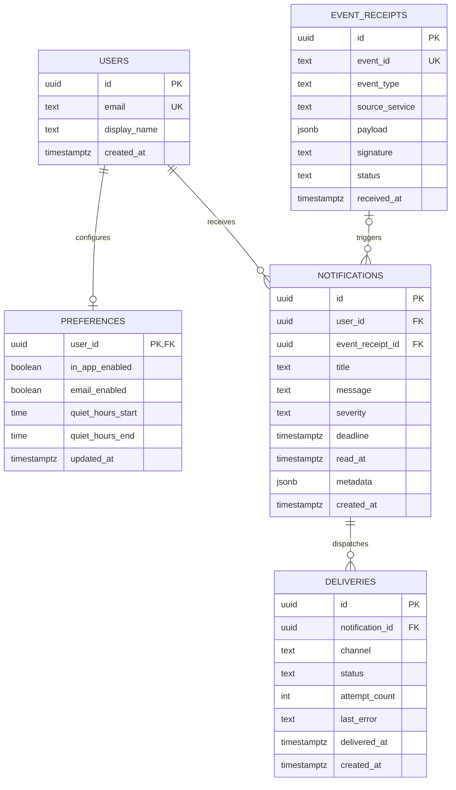

# 🔔 Notification Hub — Team 20

[](#-automated-testing)
[](https://nodejs.org/)
[](https://expressjs.com/)
[](https://supabase.com/)
[](LICENSE)

> **Assignment #3 — Database Design & Implementation**  
> **Centralized Notification Service** for receiving events from external services and delivering notifications across multiple channels.

---

## 📑 Table of Contents

- [Team Members](#-team-members--team-20)
- [System Overview](#-system-overview)
- [Key Features](#-key-features)
- [System Architecture](#-system-architecture)
- [Tech Stack](#-tech-stack)
- [Database Design](#-database-design)
  - [Why Supabase & PostgreSQL](#why-supabase--postgresql)
  - [Tables & Schemas](#tables--schemas)
  - [Relationships & Cardinality](#relationships--cardinality)
  - [Foreign Key Delete Behavior](#foreign-key-delete-behavior)
  - [Entity Relationship Diagram (ERD)](#entity-relationship-diagram-erd)
- [Database Deployment](#-database-deployment)
- [REST API Endpoints](#-rest-api-endpoints)
- [Security](#-security)
- [Getting Started](#-getting-started)
  - [Prerequisites](#prerequisites)
  - [Installation & Setup](#installation--setup)
  - [Environment Variables](#environment-variables)
  - [Database Migration](#database-migration)
  - [Running the Server](#running-the-server)
- [Automated Testing](#-automated-testing)
- [Project Structure](#-project-structure)
- [References & Documentation](#-references--documentation)

---

## 👥 Team Members — Team 20

| Student ID | Full Name | Role |
| :--- | :--- | :--- |
| **6731503103** | Nuttida Butthanoo | Frontend UX/UI |
| **6731503112** | Pechladda Duangkaew | Backend API and Database |
| **6731503028** | Montatip Khumphaithoon | Quality and Security |
| **6731503125** | Siriwimon Charoensirisoontorn | Delivery and Document |
| **6731503105** | Thanchanok Kakaew | Product Manager |

---

## 📖 System Overview

**Notification Hub** is a centralized platform for managing student and system notifications across campus platforms (e.g., Assignment, Enrollment, Timetable, and Library services). It decouples event producers from delivery channels, managing routing logic, recipient preferences, delivery auditing, and retries in one resilient service.

---

## ✨ Key Features

- **Event Ingestion:** Accepts incoming webhook events from external services.
- **HMAC Signature Verification:** Verifies request origin and payload integrity (`x-event-signature`).
- **Idempotency & Deduplication:** Prevents duplicate event processing using unique `eventId` indexing.
- **Preference Evaluation:** Routes notifications according to student channel preferences (`in_app`, `email`) and respects Quiet Hours.
- **Delivery Tracking:** Tracks granular per-channel delivery attempts, errors, and delivery timestamps.
- **Retry Mechanism:** Re-queues failed deliveries for automated retry processing.
- **Read & Delete Lifecycle:** Supports marking notifications as read and cascading notification deletion.
- **System Health Checks:** Dedicated health probes for HTTP server and Supabase database connectivity.

---

## 🏗 System Architecture

```
 External Service (Producer)
            │
            │  POST /events (HMAC SHA-256 Signature)
            ▼
┌────────────────────────────────────────────────────────┐
│                   Notification Hub                     │
│  1. Authenticate Signature (crypto HMAC-SHA256)        │
│  2. Record & Deduplicate Event (event_receipts)        │
│  3. Generate Notification Record (notifications)       │
│  4. Evaluate Recipient Preferences (preferences)       │
│  5. Dispatch Channel Deliveries (deliveries)          │
└───────────────────────────┬────────────────────────────┘
                            │
           ┌────────────────┴────────────────┐
           ▼                                 ▼
     In-App Channel                    Email Channel
  (deliveries: in_app)              (deliveries: email)
           │                                 │
           └────────────────┬────────────────┘
                            ▼
                     Delivery Status
```

---

## 🛠 Tech Stack

| Layer | Technology | Details |
| :--- | :--- | :--- |
| **Runtime** | Node.js | CommonJS Modules, v18+ |
| **Framework** | Express.js | Version 5.x REST API |
| **Database** | Supabase (PostgreSQL) | Managed Cloud Database with JSONB, Constraints & Indexes |
| **DB Client** | `@supabase/supabase-js` | Supabase JavaScript Client SDK |
| **Security** | Node.js `crypto` | HMAC SHA-256 Webhook Verification |
| **Testing** | Node.js Test Runner & Supertest | Automated integration tests (`node --test`) |
| **Dev Tools** | Nodemon, Dotenv, Cors | Development environment utilities |

---

## 🗄 Database Design

### Why Supabase / PostgreSQL

1. **Relational Data Model:** Entities (`users`, `preferences`, `event_receipts`, `notifications`, `deliveries`) have well-defined foreign-key relations.
2. **Data Integrity:** Enforced via Primary Keys, Foreign Keys, Unique constraints, Check constraints, and `NOT NULL` rules.
3. **JSONB Support:** Native binary JSON support for flexible event payloads and notification metadata.
4. **Remote Cloud Deployment:** Cloud PostgreSQL database with high availability and remote connectivity.
5. **Developer Dashboard:** Built-in SQL query editor, table browser, and relationship inspection.

---

### Tables & Schemas

The database contains five primary tables:

#### 1. `users`
Stores user profile information.

| Column | Type | Null | Default | Constraint |
| :--- | :--- | :--- | :--- | :--- |
| `id` | uuid | NO | `gen_random_uuid()` | PRIMARY KEY |
| `email` | text | NO | — | UNIQUE |
| `display_name` | text | NO | — | — |
| `created_at` | timestamptz | NO | `now()` | — |

#### 2. `preferences`
Stores user notification preferences and quiet hours.

| Column | Type | Null | Default | Constraint |
| :--- | :--- | :--- | :--- | :--- |
| `user_id` | uuid | NO | — | PRIMARY KEY, FOREIGN KEY (`users.id`) |
| `in_app_enabled` | boolean | NO | `true` | — |
| `email_enabled` | boolean | NO | `true` | — |
| `quiet_hours_start` | time | YES | `null` | — |
| `quiet_hours_end` | time | YES | `null` | — |
| `updated_at` | timestamptz | NO | `now()` | — |

#### 3. `event_receipts`
Audit log and deduplication record for incoming webhook events.

| Column | Type | Null | Default | Constraint |
| :--- | :--- | :--- | :--- | :--- |
| `id` | uuid | NO | `gen_random_uuid()` | PRIMARY KEY |
| `event_id` | text | NO | — | UNIQUE |
| `event_type` | text | NO | — | — |
| `source_service` | text | NO | — | — |
| `payload` | jsonb | NO | `'{}'::jsonb` | — |
| `signature` | text | YES | `null` | — |
| `status` | text | NO | `'accepted'` | CHECK (`status IN ('accepted', 'rejected', 'duplicate')`) |
| `received_at` | timestamptz | NO | `now()` | — |

#### 4. `notifications`
Main notification records created for users.

| Column | Type | Null | Default | Constraint |
| :--- | :--- | :--- | :--- | :--- |
| `id` | uuid | NO | `gen_random_uuid()` | PRIMARY KEY |
| `user_id` | uuid | NO | — | FOREIGN KEY (`users.id`) |
| `event_receipt_id` | uuid | YES | `null` | FOREIGN KEY (`event_receipts.id`) |
| `title` | text | NO | — | — |
| `message` | text | NO | — | — |
| `severity` | text | NO | `'low'` | CHECK (`severity IN ('low', 'medium', 'high', 'critical')`) |
| `deadline` | timestamptz | YES | `null` | — |
| `read_at` | timestamptz | YES | `null` | — |
| `metadata` | jsonb | NO | `'{}'::jsonb` | — |
| `created_at` | timestamptz | NO | `now()` | — |

#### 5. `deliveries`
Tracks dispatch attempts per channel for each notification.

| Column | Type | Null | Default | Constraint |
| :--- | :--- | :--- | :--- | :--- |
| `id` | uuid | NO | `gen_random_uuid()` | PRIMARY KEY |
| `notification_id` | uuid | NO | — | FOREIGN KEY (`notifications.id`) |
| `channel` | text | NO | — | CHECK (`channel IN ('in_app', 'email')`) |
| `status` | text | NO | `'pending'` | CHECK (`status IN ('pending', 'sent', 'failed')`) |
| `attempt_count` | integer | NO | `0` | — |
| `last_error` | text | YES | `null` | — |
| `delivered_at` | timestamptz | YES | `null` | — |
| `created_at` | timestamptz | NO | `now()` | — |

---

### Relationships & Cardinality

| From Table | To Table | Cardinality | Purpose |
| :--- | :--- | :--- | :--- |
| `users.id` | `preferences.user_id` | 1 : 1 | Each user has exactly one notification preference profile |
| `users.id` | `notifications.user_id` | 1 : N | A user can receive multiple notifications |
| `event_receipts.id` | `notifications.event_receipt_id` | 1 : N | An event receipt may trigger notification records |
| `notifications.id` | `deliveries.notification_id` | 1 : N | A notification can be delivered across multiple channels |

---

### Foreign Key Delete Behavior

| Relationship | Constraint Rule | Delete Behavior & Impact |
| :--- | :--- | :--- |
| Users → Preferences | `ON DELETE CASCADE` | Removing a user automatically deletes their preferences |
| Users → Notifications | `ON DELETE CASCADE` | Removing a user automatically deletes all their notifications |
| Event Receipts → Notifications | `ON DELETE SET NULL` | Removing an event receipt preserves notifications (`event_receipt_id` becomes `NULL`) |
| Notifications → Deliveries | `ON DELETE CASCADE` | Removing a notification automatically deletes all related delivery records |

---

### Entity Relationship Diagram (ERD)



---

## ☁️ Database Deployment

- **Hosting Platform:** Supabase Cloud
- **Database Engine:** PostgreSQL
- **Migration Script:** [`supabase/migrations/20260921_create_notification_hub_schema.sql`](supabase/migrations/20260921_create_notification_hub_schema.sql)
- **Deployment Status:** Fully deployed with schema tables, foreign key constraints, check constraints, and performance indexes:
  - `idx_notifications_user_created` on `notifications(user_id, created_at DESC)`
  - `idx_notifications_user_read` on `notifications(user_id, read_at)`
  - `idx_deliveries_notification` on `deliveries(notification_id)`
  - `idx_event_receipts_event_id` on `event_receipts(event_id)`

---

## 🚀 REST API Endpoints

**Base URL (Local Development):** `http://localhost:3000`

| Method | Endpoint | Description | Category |
| :--- | :--- | :--- | :--- |
| `POST` | `/events` | Ingests an event, validates HMAC signature, and dispatches notifications & deliveries | Event Ingestion (Create) |
| `GET` | `/notifications/me?user_id=:id` | Retrieves all notifications for a specific user | Notifications (Read) |
| `GET` | `/deliveries/:id` | Fetches delivery record details and dispatch status | Delivery Tracking (Read) |
| `PATCH`| `/preferences` | Updates user notification channels and quiet hours | Preferences (Update) |
| `POST` | `/notifications/:id/read` | Marks a notification as read (updates `read_at`) | Notification Action (Update) |
| `POST` | `/notifications/:id/retry` | Re-queues a failed delivery for retry | Delivery Action (Update) |
| `DELETE`| `/notifications/:id` | Deletes a notification (cascades to related deliveries) | Notification Action (Delete) |
| `GET` | `/health` | Server uptime and health probe | System Health Check |
| `GET` | `/health/supabase` | Verifies active database connection to Supabase | Database Health Check |

> Detailed request headers, JSON payloads, and response examples are available in [`docs/api-examples.md`](docs/api-examples.md).

---

## 🔒 Security

- **Webhook Signature:** `POST /events` requires an HMAC SHA-256 signature passed in the `x-event-signature` header.
- **Shared Secret:** The webhook verification secret is stored in `EVENT_WEBHOOK_SECRET`.
- **Database Credentials:** The Supabase service role key is stored in `SUPABASE_SERVICE_ROLE_KEY`.
- **Environment Isolation:** Secrets are kept in `.env` and strictly excluded from version control via `.gitignore`.
- **Template Provided:** An `.env.example` file is included for safe configuration sharing.

---

## 💻 Getting Started

### Prerequisites

- [Node.js](https://nodejs.org/) (v18 or higher)
- A [Supabase](https://supabase.com/) project with PostgreSQL

### Installation & Setup

1. **Clone the repository:**
   ```bash
   git clone https://github.com/Pechladda/notification-hub-team20.git
   cd notification-hub-team20
   ```

2. **Install dependencies:**
   ```bash
   npm install
   ```

### Environment Variables

Copy the template file to create your `.env`:
```bash
cp .env.example .env
```

Fill in your configuration in `.env`:
```env
PORT=3000
SUPABASE_URL=https://<your-project-id>.supabase.co
SUPABASE_SERVICE_ROLE_KEY=<your-supabase-service-role-key>
EVENT_WEBHOOK_SECRET=<your-hmac-webhook-secret>
```

### Database Migration

Apply the SQL migration script to your Supabase PostgreSQL instance using the Supabase SQL Editor:
```text
supabase/migrations/20260921_create_notification_hub_schema.sql
```

### Running the Server

- **Development Mode (with Nodemon hot-reload):**
  ```bash
  npm run dev
  ```
- **Production Mode:**
  ```bash
  npm start
  ```

The server will listen at `http://localhost:3000`.

---

## 🧪 Automated Testing

The project includes an automated integration test suite using the Node.js test runner and Supertest:

```bash
npm test
```

### Test Suite Results (10/10 Passed)

```text
✔ POST /events should create only in-app delivery when email is disabled
✔ GET /deliveries/:id should return delivery details
✔ POST /notifications/:id/read should mark notification as read
✔ POST /notifications/:id/retry should retry failed delivery
✔ DELETE /notifications/:id should delete a notification
✔ POST /events should reject request without signature
✔ POST /events should accept a valid signed event
✔ POST /events should reject duplicate eventId
✔ GET /health should return service health
✔ PATCH /preferences should update notification preferences

tests 10 | pass 10 | fail 0
```

---

## 📂 Project Structure

```text
Notification-Hub/
├── docs/                               # Comprehensive project documentation
│   ├── assignment-3.md                 # Assignment #3 database design report
│   ├── api-examples.md                 # Full request/response API catalog
│   ├── database-schema.md              # Detailed schema specification & constraints
│   └── ER-Diagram.md                   # Entity Relationship Diagram & documentation
├── src/
│   ├── config/
│   │   └── supabase.js                 # Supabase client initialization
│   ├── routes/
│   │   ├── delivery.routes.js          # Delivery query routes
│   │   ├── event.routes.js             # Event ingestion, auth & deduplication
│   │   ├── notification.routes.js      # User notification retrieval
│   │   ├── notification-action.routes.js # Mark-as-read routes
│   │   ├── notification-delete.routes.js # Notification deletion routes
│   │   ├── preference.routes.js        # Preference management routes
│   │   └── retry.routes.js             # Delivery retry routes
│   └── app.js                          # Express application & middleware setup
├── supabase/
│   └── migrations/
│       └── 20260921_create_notification_hub_schema.sql # DDL Migration Script
├── test/                               # Automated integration test suite
│   ├── delivery.test.js
│   ├── event.test.js
│   ├── health.test.js
│   └── preference.test.js
├── .env.example                        # Environment variable template
├── package.json                        # Project metadata, dependencies & scripts
├── server.js                           # Application entry point
└── README.md                           # Main repository documentation
```

---

## 📚 References & Documentation

- [Assignment #3 Report](docs/assignment-3.md)
- [Product Requirements Document (PRD)](PRD.md)
- [API Examples & Guide](docs/api-examples.md)
- [Database Schema Specification](docs/database-schema.md)
- [Entity Relationship Diagram](docs/ER-Diagram.md)
