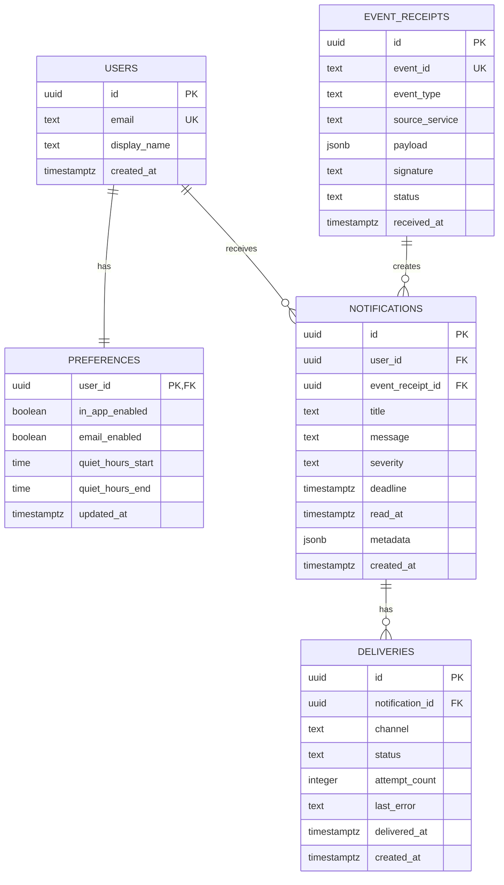

# Notification Hub ER Diagram

## Entity Relationship Diagram



---

# Entity Descriptions

## USERS

Stores basic information about users.

Important fields:

```text
id
email
display_name
created_at
```

Primary key:

```text
users.id
```

Unique field:

```text
users.email
```

---

## PREFERENCES

Stores notification preferences for users.

Important fields:

```text
user_id
in_app_enabled
email_enabled
quiet_hours_start
quiet_hours_end
updated_at
```

Primary key:

```text
preferences.user_id
```

Foreign key:

```text
preferences.user_id → users.id
```

Delete behavior:

```text
ON DELETE CASCADE
```

---

## EVENT_RECEIPTS

Stores events received from external services.

Important fields:

```text
id
event_id
event_type
source_service
payload
signature
status
received_at
```

Primary key:

```text
event_receipts.id
```

Unique field:

```text
event_receipts.event_id
```

The unique event ID supports duplicate event detection.

---

## NOTIFICATIONS

Stores notifications generated from received events.

Important fields:

```text
id
user_id
event_receipt_id
title
message
severity
deadline
read_at
metadata
created_at
```

Primary key:

```text
notifications.id
```

Foreign keys:

```text
notifications.user_id
    → users.id

notifications.event_receipt_id
    → event_receipts.id
```

Delete behavior:

```text
user_id:
ON DELETE CASCADE

event_receipt_id:
ON DELETE SET NULL
```

---

## DELIVERIES

Stores delivery information for notifications.

Important fields:

```text
id
notification_id
channel
status
attempt_count
last_error
delivered_at
created_at
```

Primary key:

```text
deliveries.id
```

Foreign key:

```text
deliveries.notification_id
    → notifications.id
```

Delete behavior:

```text
ON DELETE CASCADE
```

---

# Relationships

## Users → Preferences

One user has one preference record.

```text
USERS 1 ───── 1 PREFERENCES
```

---

## Users → Notifications

One user can receive many notifications.

```text
USERS 1 ───── N NOTIFICATIONS
```

---

## Event Receipts → Notifications

One event receipt can be associated with many notifications.

```text
EVENT_RECEIPTS 1 ───── N NOTIFICATIONS
```

---

## Notifications → Deliveries

One notification can have many deliveries.

```text
NOTIFICATIONS 1 ───── N DELIVERIES
```

---

# Overall Data Model

```text
                    ┌─────────────────┐
                    │      USERS      │
                    │─────────────────│
                    │ PK id           │
                    │ email           │
                    │ display_name    │
                    └───────┬─────────┘
                            │
              ┌─────────────┴─────────────┐
              │                           │
              │ 1:1                       │ 1:N
              ▼                           ▼
    ┌─────────────────┐         ┌────────────────────┐
    │   PREFERENCES   │         │   NOTIFICATIONS    │
    │─────────────────│         │────────────────────│
    │ PK/FK user_id   │         │ PK id              │
    │ in_app_enabled  │         │ FK user_id         │
    │ email_enabled   │         │ FK event_receipt_id│
    │ quiet_hours     │         │ title              │
    └─────────────────┘         │ message            │
                                │ severity           │
                                │ read_at            │
                                └─────────┬──────────┘
                                          │
                                          │ 1:N
                                          ▼
                                ┌────────────────────┐
                                │     DELIVERIES     │
                                │────────────────────│
                                │ PK id              │
                                │ FK notification_id │
                                │ channel            │
                                │ status             │
                                │ attempt_count      │
                                └────────────────────┘


    ┌────────────────────┐
    │   EVENT_RECEIPTS   │
    │────────────────────│
    │ PK id              │
    │ UK event_id        │
    │ event_type         │
    │ source_service     │
    │ payload            │
    │ signature          │
    │ status             │
    │ received_at        │
    └─────────┬──────────┘
              │
              │ 1:N
              └──────────────────────► NOTIFICATIONS
```

---

# Referential Integrity

The database uses foreign keys to maintain relationships:

```text
preferences.user_id
        ↓
users.id
```

```text
notifications.user_id
        ↓
users.id
```

```text
notifications.event_receipt_id
        ↓
event_receipts.id
```

```text
deliveries.notification_id
        ↓
notifications.id
```

---

# Delete Behavior Summary

| Relationship | Delete Behavior |
|---|---|
| Users → Preferences | CASCADE |
| Users → Notifications | CASCADE |
| Event Receipts → Notifications | SET NULL |
| Notifications → Deliveries | CASCADE |

---

# Database Design Notes

The design separates the main responsibilities of the Notification Hub:

```text
USERS
    ↓
User identity

PREFERENCES
    ↓
Notification settings

EVENT_RECEIPTS
    ↓
Incoming external events

NOTIFICATIONS
    ↓
User-facing notifications

DELIVERIES
    ↓
Delivery tracking
```

This separation allows the system to independently manage incoming events, notifications, user preferences, and delivery attempts.